# Setting up a Frontend Project

- Go to tailwind - FRAMEWORK > vite - copy paste the instruction in terminal

# DaisyUI

- We will be using external library to make the UI
- Go to installation section in DaisyUI
- npm i daisyUi > in tailwind.config.js paste plugins
- To test DaisyUI search navbar - paste in app.js
- Will create seprate components (file and folder) for seprate components
- src > component > Navbar.jsx

# React-Router-DOM

- install react router dom
- In app.jsx follow the following code
- 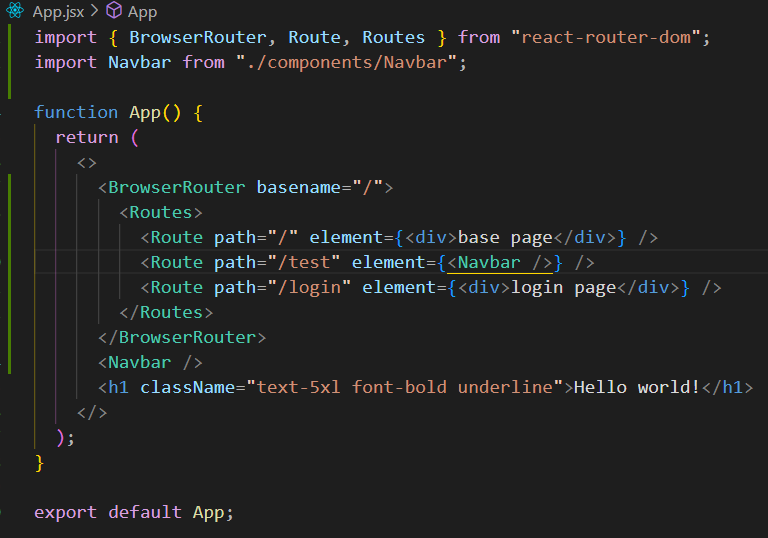
- We will structure our frontend (app.jsx)
- First mainly we will have Body component > then inside its different routes
- App.jsx will be
- 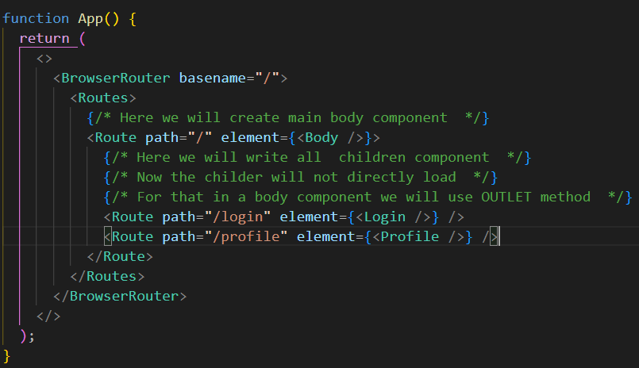
- Body.jsx
- 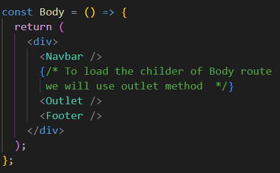

# LOGIN FORM

- Creating login form with the help of daisy UI
- Making a input feilds working
- With the help of useState hook we will make input feild dynamic
- Add the value to input and password feild and onchange to e.target.value
- create handleLogin function and add to login button
- To make our login form working we need to call login api
- To make API call we will use external package Axios
- Install Axios
- Write the following code to call API
- 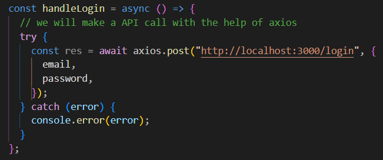
- Still we will not be able to call the api because of CORS error
- To resolve CORS error in backend instal "cors"
- in app.js(backend) import cors app.use(cors())
- Here we are not receiving the token to fix this thing we have to put parameters in cors()
- {origin:"frontend url",creadential:true}
- in frontEnd - pass one more parameter in axios withcreditentials:true

# REDUX TOOLKIT

- Install redux-toolkit
- Install react-redux
- Create a folder - src > utils > appStore.js
- In appStore.js create configureStore
- 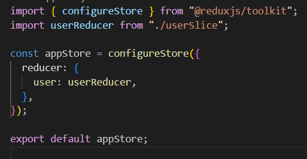
- To make work redux in our react wrap Browserrouter with Provider{store{appStore}}
- Create a file in same folder - userSlice.js
- with help of createSlice create userSlice
- 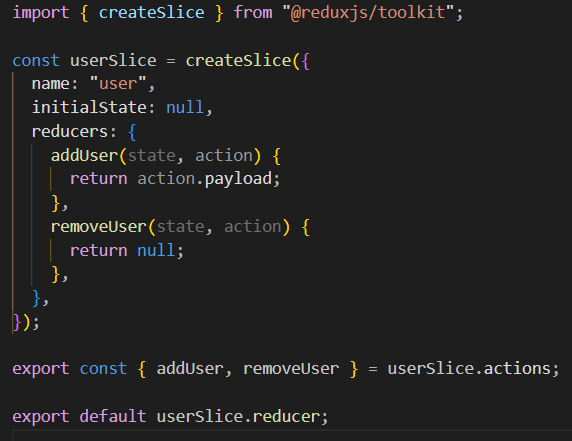
- export reducers and action
- import to appStore.js
- In login we will use the actions create in userSlice
- we have a hook useDispatch with the help of it we store the data got from api to our redux store
- 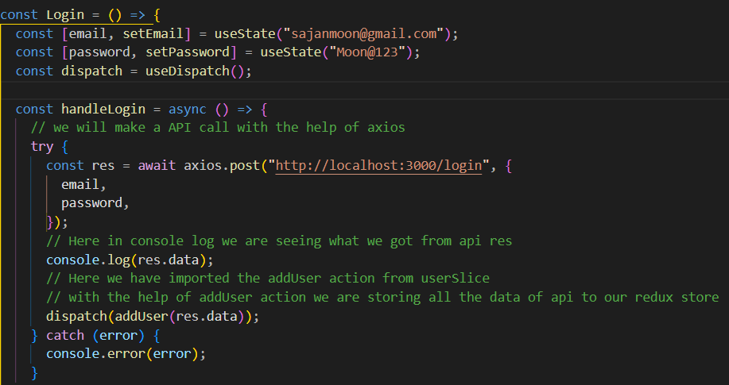
- we now using our redux store in our project to display the profile pic of user
  for that we are using useSelector hook which will subscribe/get/use the data from redux store
  which the stored with userDispatch hook
- 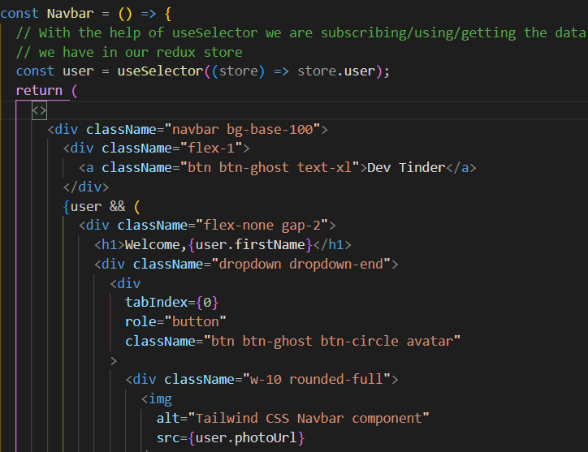
- We are now making a function where after we login page should redirect to feed page
- in login.jsx we will use hook useNavigate and give path "/"

# LOGGEDIN AFTER REFRESH

- In a Body.js call a profile/view API with axios
- Add a parameter in API with credentials true
- With useDispatch save data to redux with addUser Reducer
- in a try catch error add navigate to ("/login") to not able to acced any page without login
- 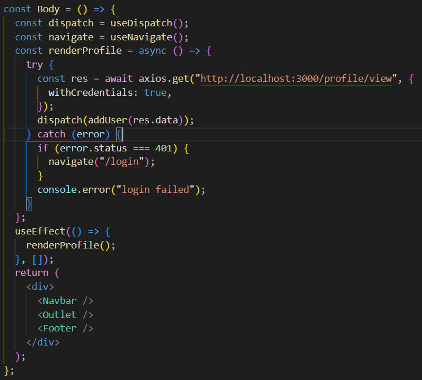

# LOGOUT

- in a navbar add a handleLogout function to LOGOUT button
- create handleLogout - function > call logout API using axios
- empty redux store with removeUser reducer
- navigate page to "/login"
- 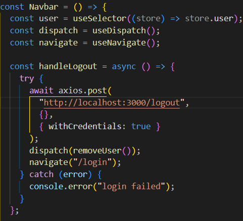
- handle error in login.js
- add a dynamic text above login button
- with useState make it work dynamic
- 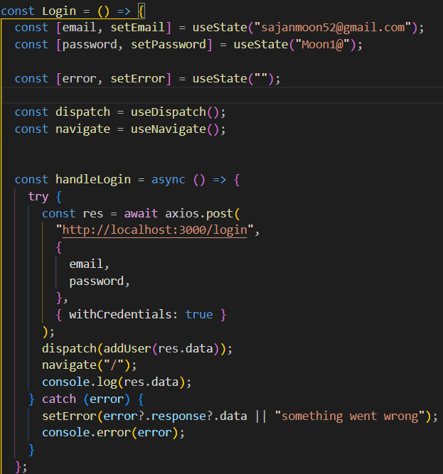

# FEED

- make feedSlice in redux store > addFeed , removeFeed reducers
- make a Usercard.jsx, with daisyUI import a user card
- in feed.jsx call feed API
- update redux store
- with useSelector make all the data dynamic
- with useEffect render the card
- 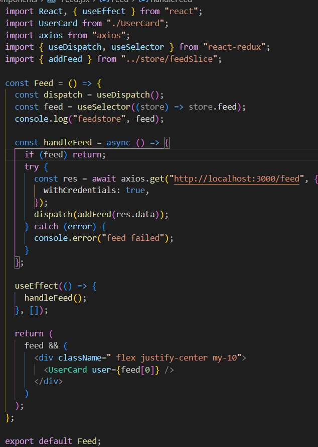

# PROFILE (UPDATE PROFILE)

- make a Editprofile.jsx import in profile
- in editprofile build a form feild to edit
- add user card to edit make them flex to see live changes
- make a api call profile/edit
- in profile.jsx get a data from store with useSelector
- with props pass to editprofile
- 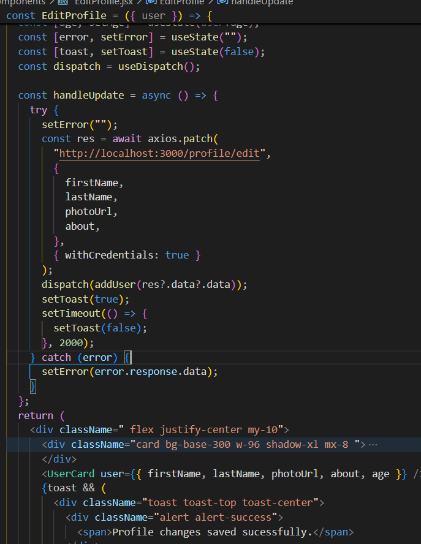
- 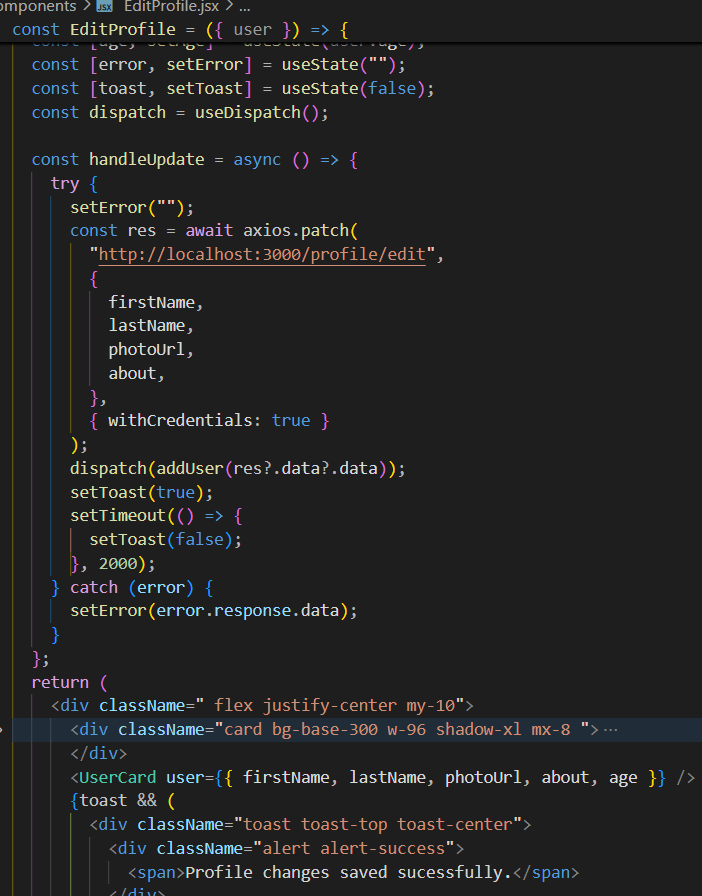
